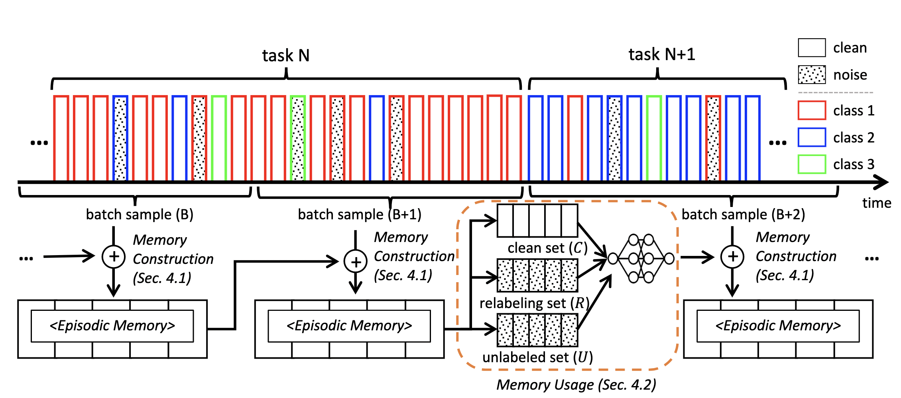

## PuriDivER - Official Pytorch Implementation 



**Online Continual Learning on a Contaminated Data Stream with Blurry Task Boundaries**<br>
Jihwan Bang, Hyunseo Koh, Seulki Park, Hwanjun Song, Jung-Woo Ha, Jonghyun Choi <br>
CVPR 2022 <br>
[Paper](https://arxiv.org/abs/2203.15355) |
[Slide]() | [Video]() | [Bibtex](#Citation)<br>

## Abstract 
Learning under a continuously changing data distribution with incorrect labels is a desirable real-world problem
yet challenging. A large body of continual learning (CL)
methods, however, assumes data streams with clean labels,
and online learning scenarios under noisy data streams are
yet underexplored. We consider a more practical CL task
setup of an online learning from blurry data stream with
corrupted labels, where existing CL methods struggle. To
address the task, we first argue the importance of both diversity and purity of examples in the episodic memory of
continual learning models. To balance diversity and purity in the episodic memory, we propose a novel strategy
to manage and use the memory by a unified approach of
label noise aware diverse sampling and robust learning
with semi-supervised learning. Our empirical validations
on four real-world or synthetic noise datasets (CIFAR10
and 100, mini-WebVision, and Food-101N) exhibit that our
method significantly outperforms prior arts in this realistic
and challenging continual learning scenario.

## Overview of the results of PuriDivER
The table is shown for last accuracy comparison with combination of selection methods 
and robust learning in CIFAR-10.

| sampling / robust | SYM-20   | SYM-40   | SYM-60   | ASYM-20  | ASYM-40  |
|------------------|----------|----------|----------|----------|----------|
| RSV / none       | 54.5     | 39.2     | 28.7     | 53.6     | 40.0     |
| RSV / SELFIE     | 54.5     | 39.2     | 28.8     | 51.8     | 40.4     |
| RSV / Co-Teaching | 56.1     | 39.8     | 30.5     | 53.5     | 38.7     |
| RSV / DivideMix  | 56.1     | 43.7     | 35.1     | 56.1     | 38.9     |
| GBS / none       | 54.8     | 41.8     | 27.3     | 54.2     | 40.4     |
| GBS / SELFIE     | 55.4     | 41.6     | 27.8     | 51.3     | 40.7     |
| GBS / Co-Teaching | 55.1     | 42.7     | 31.4     | 54.0     | 39.5     |
| GBS / DivideMix  | 57.8     | 48.8     | 34.3     | 57.4     | 44.6     |
| RM / none        | 57.1     | 46.5     | 33.5     | 58.3     | 46.2     |
| RM / SELFIE      | 56.8     | 44.8     | 31.8     | 57.9     | 46.9     |
| RM / Co-Teaching | 57.5     | 47.6     | 35.1     | 58.5     | 45.9     |
| RM / DivideMix   | 61.3     | 50.9     | 34.9     | 60.6     | 46.4     |
| **PuriDivER**    | **61.3** | **59.2** | **52.4** | **61.6** | **47.1** |

## Updates 
- March, 2022: Upload all the codes for experiments. 

## Getting started
### Requirements 
- Python3
- PyTorch (>1.0)
- torchvision (>0.2)
- torch_optimizer 
- pandas >= 1.1.3
- numpy 
- pillow >= 6.2.1
- randaugment
- easydict
- tensorboard

### Datasets 
All the datasets are saved in `dataset` directory by following formats as shown below.

```angular2html
[dataset name] 
    |_train
        |_[class1 name]
            |_00001.png
            |_00002.png 
            ...
        |_[class2 name]
            ... 
    |_test (val for ImageNet)
        |_[class1 name]
            |_00001.png
            |_00002.png
            ...
        |_[class2 name]
            ...
```
You can easily download the dataset following above format.

- CIFAR-10: https://github.com/hwany-j/cifar10_png
- CIFAR-100: https://github.com/hwany-j/cifar100_png
- WebVision: https://data.vision.ee.ethz.ch/cvl/webvision/download.html
- Food-101N: https://kuanghuei.github.io/Food-101N/

### Usage 
To run the experiments in the paper, you just run `run_experiment.py`.
```angular2html
python run_experiment.py 
```
- `args.robust_type`: Select one of the robust types. [*none*, *SELFIE*, *CoTeaching*, *DivideMix*, *PuriDivER*]
- `args.mem_manage`: Select one of the memory management. [*RSV*, *GBS*, *RM*, *PuriDivER*]
- `args.dataset`: Select dataset among those candidates. [*cifar10*, *cifar100*, *WebVision-V1-2*, *Food-101N*]
- `args.exp_name`(In CIFARs): Select synthetic noise ratio. [*blurry10_symN20*, *blurry10_symN40*, *blurry10_symN60*, *blurry10_asymN20*, *blurry10_asymN40*]
If you select WebVision-V1-2 or Food-101N, you should set it as *blurry10*.

### Results
There are three types of logs during running experiments; logs, results, tensorboard. 
The log files are saved in `logs` directory, and the results which contains accuracy of each task 
are saved in `results` directory. 
```angular2html
root_directory
    |_ logs 
        |_ [dataset]
            |_{mode}_{mem_manage}_{stream}_msz{k}_rnd{seed_num}_{trans}.log
            |_ ...
    |_ results
        |_ [dataset]
            |_{mode}_{mem_manage}_{stream}_msz{k}_rnd{seed_num}_{trans}.npy
            |_...
```

In addition, you can also use the `tensorboard` as following command.
```angular2html
tensorboard --logdir tensorboard
```

## Citation 
```angular2
@InProceedings{puridiver_cvpr22,
    author    = {Bang, Jihwan and Koh, Hyunseo and Park, Seulki and Song, Hwanjun and Ha, Jung-Woo and Choi, Jonghyun},
    title     = {Online Continual Learning on a Contaminated Data Stream with Blurry Task Boundaries},
    booktitle = {Proceedings of the IEEE/CVF Conference on Computer Vision and Pattern Recognition (CVPR)},
    month     = {June},
    year      = {2022}
}
```

## License 
```angular2html
Copyright 2022-present NAVER Corp.

This program is free software: you can redistribute it and/or modify
it under the terms of the GNU General Public License as published by
the Free Software Foundation, either version 3 of the License, or
(at your option) any later version.

This program is distributed in the hope that it will be useful,
but WITHOUT ANY WARRANTY; without even the implied warranty of
MERCHANTABILITY or FITNESS FOR A PARTICULAR PURPOSE.  See the
GNU General Public License for more details.

You should have received a copy of the GNU General Public License
along with this program.  If not, see <https://www.gnu.org/licenses/>.
```

